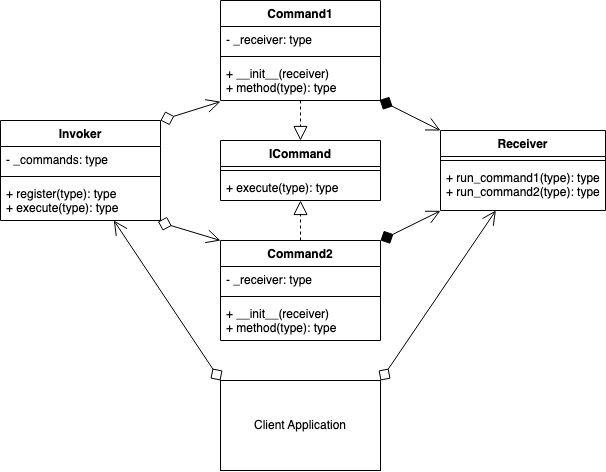
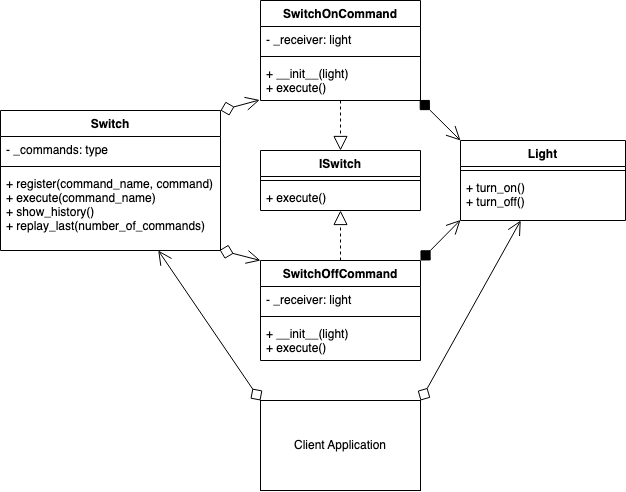

# Command Design Pattern
## Overview 
The Command pattern is a behavioral design pattern, in which an abstraction exists between an object that invokes a command, and the object that performs it.

E.g., a button will call the Invoker, that will call a pre-registered Command, that the Receiver will perform.

A Concrete Class will delegate a request to a command object, instead of implementing the request directly.

The command pattern is a good solution for implementing UNDO/REDO functionality into your application.

Uses:

- GUI Buttons, menus
- Macro recording
- Multi-level undo/redo
- Networking - send whole command objects across a network, even as a batch
- Parallel processing or thread pools
- Transactional behavior
- Wizards

## Decorator UML Diagram

## Builder Example UML Diagram

## Summary
- Use the decorator when you want to add responsibilities to objects dynamically without affecting the inner object.
- You want the option to later remove the decorator from an object in case you no longer need it.
- It is an alternative method to creating multiple combinations of subclasses. I.e., Instead of creating a subclass with all combinations of objects A, B, C in any order, and including/excluding objects, you could create 3 objects that can decorate each other in any order you want. E.g., (D(A(C))) or (B(C)) or (A(B(A(C))))
- The decorator, compared to using static inheritance to extend, is more flexible since you can easily add/remove the decorators at runtime. E.g., use in a recursive function.
- A decorator supports recursive composition. E.g., halve(halve(number))
- A decorator shouldn't modify the internal objects data or references. This allows the original object to stay intact if the decorator is later removed.