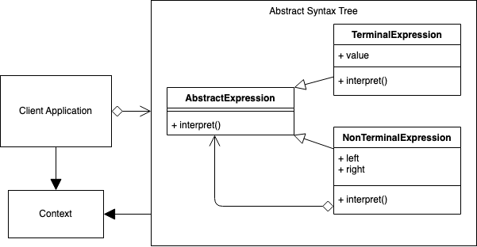
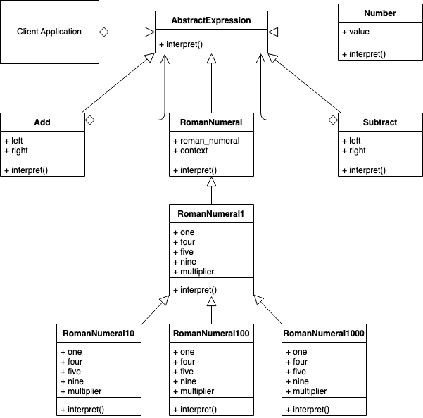

# Observer Pattern
## Overview 
The Interpreter pattern helps to convert information from one language into another.

The language can be anything such as words in a sentence, numerical formulas or even software code.

The process is to convert the source information, into an Abstract Syntax Tree (AST) of Terminal and Non-Terminal expressions that all implement an interpret() method.

A Non-Terminal expression is a combination of other Non-Terminal and/or Terminal expressions.

Terminal means terminated, i.e., there is no further processing involved.

An AST root starts with a Non-Terminal expression and then resolves down each branch until all expressions terminate.

An example expression is A + B.

The A and B are Terminal expressions and the + is Non-Terminal because it depends on the two other Terminal expressions.

The Image below, is an AST for the expression 5 + 4 - 3 + 7 - 2

The official Interpreter pattern described in the original GoF Design Patterns book does not state how to construct an Abstract Syntax Tree. How your tree is constructed will depend on the grammatical constructs of your sentence that you want to interpret.

Abstract Syntax Trees can be created manually or dynamically from a custom parser script. In the first example code below, I construct the AST manually.

Once the AST is created, you can then choose the root node and then run the Interpret operation on that, and it should interpret the whole tree recursively.

## Decorator UML Diagram

## Builder Example UML Diagram

## Summary
- ASTs are hard to create and are an enormous subject in themselves. My recommended approach is to create them manually first using a sample sentence to help understand all the steps individually, and then progress the conversion to be fully dynamic one step at a time ensuring that the grammatical constructs still work as you continue to progress.

- The Interpreter pattern uses a class to represent each grammatical rule.

- ASTs consist of multiple Non-Terminal and Terminal Expressions, that all implement an interpret() method.

- Note that in the sample code above, the interpret() methods in the Non-Terminal expressions, all call further interpret() recursively. Only the Terminal expressions interpret() method returns an explicit value. See the Number class in the above code.