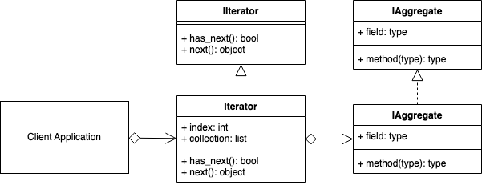

# Iterator Design Pattern
## Overview 
The Iterator will commonly contain two methods that perform the following concepts.

- next: returns the next object in the aggregate (collection, object).
- has_next: returns a Boolean indicating if the Iterable is at the end of the iteration or not.

The benefits of using the Iterator pattern are that the client can traverse a collection of aggregates(objects) without needing to understand their internal representations and/or data structures.

## Decorator UML Diagram

## Builder Example UML Diagram

## Summary
- ASTs are hard to create and are an enormous subject in themselves. My recommended approach is to create them manually first using a sample sentence to help understand all the steps individually, and then progress the conversion to be fully dynamic one step at a time ensuring that the grammatical constructs still work as you continue to progress.

- The Interpreter pattern uses a class to represent each grammatical rule.

- ASTs consist of multiple Non-Terminal and Terminal Expressions, that all implement an interpret() method.

- Note that in the sample code above, the interpret() methods in the Non-Terminal expressions, all call further interpret() recursively. Only the Terminal expressions interpret() method returns an explicit value. See the Number class in the above code.