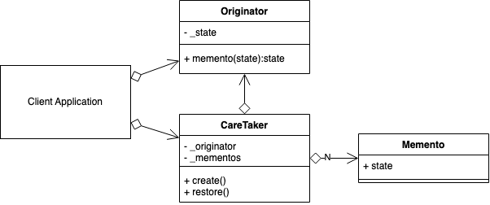
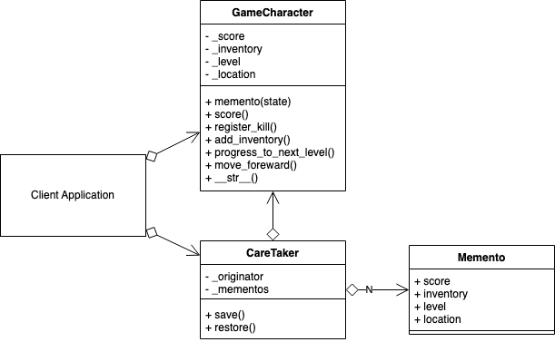

# Memento Design Pattern
## Overview 
Throughout the lifecycle of an application, an objects state may change. You might want to store a copy of the current state in case of later retrieval. E.g., when writing a document, you may want to auto save the current state every 10 minutes. Or you have a game, and you want to save the current position of your player in the level, with its score and current inventory.

You can use the Memento pattern for saving a copy of state and for later retrieval if necessary.

The Memento pattern, like the Command pattern, is also commonly used for implementing UNDO/REDO functionality within your application.

The difference between the Command and the Memento patterns for UNDO/REDO, is that in the Command pattern, you re-execute commands in the same order that changed attributes of a state, and with the Memento, you completely replace the state by retrieving from a cache/store.

## Decorator UML Diagram

## Builder Example UML Diagram

## Summary
- You don't need to create a new Memento each time an Originators state changes. You can do it only when considered necessary. E.g., an occasional backup to a file.

- Mementos can be stored in memory or saved/cached externally. The Caretaker will abstract the complications of storing and retrieving Mementos from the Originator.

- Consider the Command pattern for fine-grained changes to an objects state to manage UNDO/REDO between memento saves. Or even save command history into a Memento that can be later replayed.

- In my examples, the whole state is recorded and changed with the Memento. You can use the Memento to record and change partial states instead if required.

- When copying state, be aware of shallow/deep copying. In complicated projects, your restore functionality will probably contain a combination of both the Command and Memento patterns.