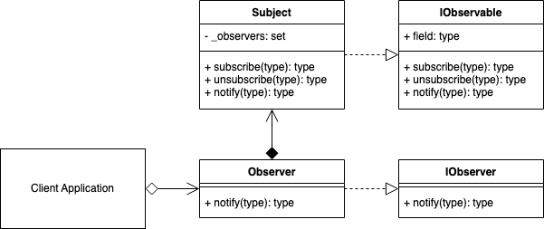
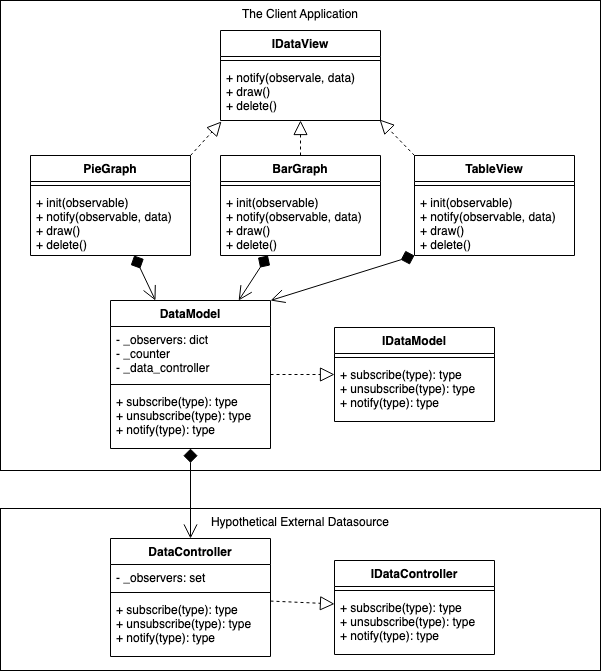

# Observer Pattern
## Overview 
The Observer pattern is a software design pattern in which an object, called the Subject (Observable), manages a list of dependents, called Observers, and notifies them automatically of any internal state changes by calling one of their methods.

The Observer pattern follows the publisher/subscribe concept. A subscriber, subscribes to a publisher. The publisher then notifies the subscribers when necessary.

The observer stores state that should be consistent with the subject. The observer only needs to store what is necessary for its own purposes.

A typical place to use the observer pattern is between your application and presentation layers. Your application is the manager of the data and is the single source of truth, and when the data changes, it can update all the subscribers, that could be part of multiple presentation layers. For example, the score was changed in a televised cricket game, so all the web browser clients, mobile phone applications, leaderboard display on the ground and television graphics overlay, can all now have the updated information synchronized.

Most applications that involve a separation of data into a presentation layer can be broken further down into the Model-View-Controller (MVC) concept.

- Controller : The single source of truth.
- Model : The link or relay between a controller and a view. It may use any of the structural patterns (adapter, bridge, facade, proxy, etc.) at some point.
- View : The presentation layer of the data from the model.
The observer pattern can be used to manage the transfer of data across any layer and even internally to itself to add an abstraction. In the MVC structure, the View can be a subscriber to the Model, that in turn can also be a subscriber to the controller. It can also happen the other way around if the use case warrants.

The Observer pattern allows you to vary subjects and observers independently. You can reuse subjects without reusing their observers, and vice versa. It lets you add observers without modifying the subject or any of the other observers.

The observer pattern is commonly described as a push model, where the subject pushes any updates to all observers. But observers can pull for updates and also only if it decides it is necessary.

Whether you decide to use a push or pull concept to move data, then there are pros and cons to each. You may decide to use a combination of both to manage reliability.

E.g., When sending messages across a network, the receiving client, can be slow to receive the full message that was sent, or even timeout. This pushing from the sender's side can increase the amount of network hooks or threads if there are many messages still waiting to be fully delivered. The subject is taking responsibility for the delivery.

On the other hand, if the observer requests for an update from the subscriber, then the subject (observable) can return the information as part of the requests' response. The observer could also indicate as part of the request, to only return data applicable to X, that would then make the response message smaller to transfer at the expense of making the observable more coupled to the observer.

Use a push mechanism from the subject when updates are absolutely required in as close to real time from the perspective of the observer, noting that you may need to manage the potential of extra unresolved resources queuing up at the sender.

If updates on the observer end are allowed to suffer from some delay, then a pull mechanism is most reliable and easiest to manage since it is the responsibility of the observer to synchronize its state.

## Decorator UML Diagram

## Builder Example UML Diagram

## Summary
- Use when a change to one object requires changing others, and you don't know how many other objects need to be changed.
- A subject has a list of observers, each conforming to the observer interface. The subject doesn't need to know about the concrete class of any observer. It will notify the observer using the method described in the interface.
Subjects and Observers can belong to any layer of a system whether extremely large or small.
- Using a Push or Pull mechanism for the Observer will depend on how you want your system to manage redundancy for particular data transfers. These things become more of a consideration when the Observer is separated further away from a subject and the message needs to traverse many layers, processes and systems.