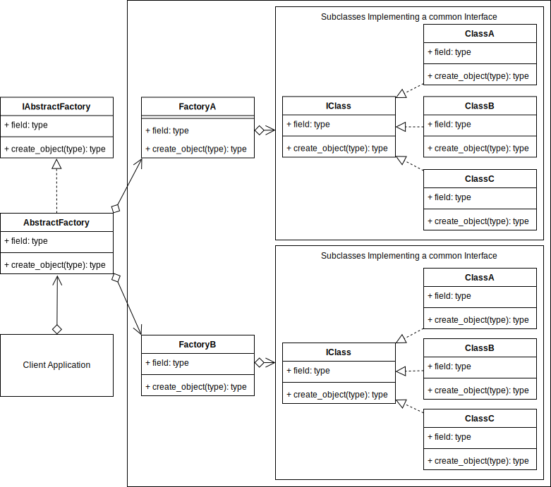
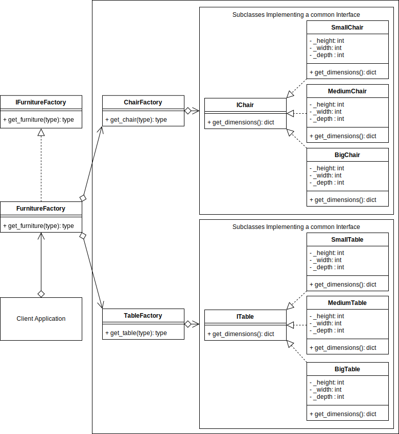

# **Abstract Factory Design Pattern**
## Overview
The Abstract Factory Pattern adds an abstraction layer over multiple other creational pattern implementations.
## Abstract Factory UML Diagram
<picture>
  
</picture>

## Abstract Factory Example UML Diagram
<picture> 
  
</picture>

## Summary 
- Use when you want to provide a library of relatively similar products from multiple different factories.
- You want the system to be independent of how the products are created.
- The client implements the abstract factory interface, rather than all the internal logic and Factories. This allows the possibility of creating a library that can be imported for using the Abstract Factory.
- The Abstract Factory defers the creation of the final products/objects to its concrete factory subclasses
- You want to enforce conss=istent interfaces across products.
- You want the posssibility to exchange product families.