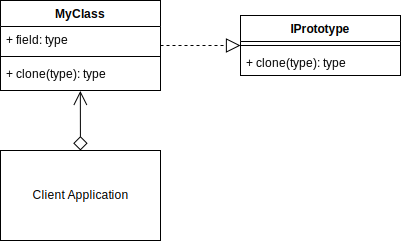
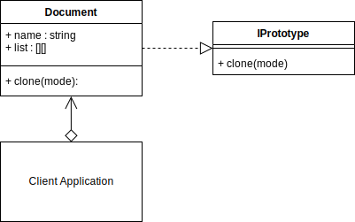

# Prototype Design Pattern
## Overview 
The Prototype design pattern is good for when creating new objects requires more resources than you want to use or have available. You can save resources by just creating a copy of any existing object that is already in memory.

E.g., A file you've downloaded from a server may be large, but since it is already in memory, you could just clone it, and work on the new copy independently of the original.

In the Prototype patterns interface, you create a static clone method that should be implemented by all classes that use the interface. How the clone method is implemented in the concrete class is up to you. You will need to decide whether a shallow or deep copy is required.

- A shallow copy, copies and creates new references one level deep,
- A deep copy, copies and creates new references for all levels.

In Python, you have mutable objects such as Lists, Dictionaries, Sets and any custom Objects you may have created. A shallow copy, will create new copies of the objects with new references in memory, but the underlying data, e.g., the actual elements in a list, will point to the same memory location as the original list/object being copied. You will now have two lists, but the elements within the lists will point to the same memory location. So, changing any elements of a copied list will also affect the original list. Be sure to test your implementation that the copy method you use works as expected. Shallow copies are much faster to process than deep copies and deep copies are not always necessary if you are not going to benefit from using it.
## Prototype UML Diagram
<picture>
  
</picture>

## Builder Example UML Diagram
<picture> 
  
</picture>