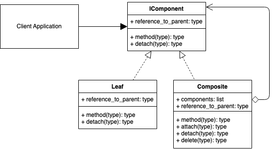

# Composite Design Pattern
## Overview 
The Composite design pattern is a structural pattern useful for hierarchical management.

The Composite design pattern,

- Allows you to represent individual entities(leaves) and groups of leaves as the same.
- Is a structural design pattern that lets you compose objects into a changeable tree structure.
- Is great if you need the option of swapping hierarchical relationships around.
- Allows you to add/remove components to the hierarchy.
- Provides flexibility of structure

Examples of using the Composite Design Pattern can be seen in a file system directory structure where you can swap the hierarchy of files and folders, and also in a drawing program where you can group, ungroup, transform objects and change multiple objects at the same time.

## Decorator UML Diagram

## Builder Example UML Diagram

## Summary
- Use the decorator when you want to add responsibilities to objects dynamically without affecting the inner object.
- You want the option to later remove the decorator from an object in case you no longer need it.
- It is an alternative method to creating multiple combinations of subclasses. I.e., Instead of creating a subclass with all combinations of objects A, B, C in any order, and including/excluding objects, you could create 3 objects that can decorate each other in any order you want. E.g., (D(A(C))) or (B(C)) or (A(B(A(C))))
- The decorator, compared to using static inheritance to extend, is more flexible since you can easily add/remove the decorators at runtime. E.g., use in a recursive function.
- A decorator supports recursive composition. E.g., halve(halve(number))
- A decorator shouldn't modify the internal objects data or references. This allows the original object to stay intact if the decorator is later removed.