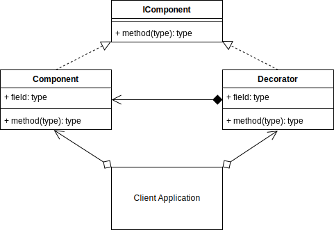
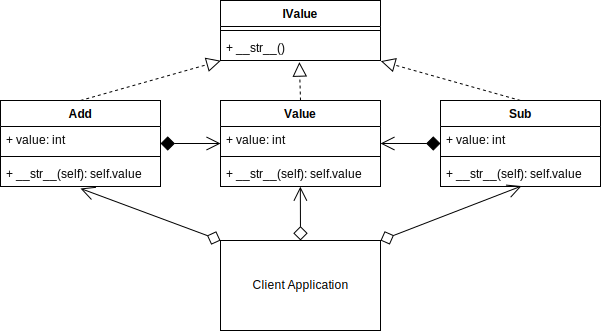

# Singleton Design Pattern
## Overview 
The decorator pattern is a structural pattern, that allows you to attach additional responsibilities to an object at runtime.

The decorator pattern is used in both the Object-Oriented and Functional paradigms.

The decorator pattern is different from the Python language feature of Python Decorators in its syntax and complete purpose. It is a similar concept in the way that it is a wrapper, but it also can be applied at runtime dynamically.

The decorator pattern adds extensibility without modifying the original object.

The decorator forwards requests to the enclosed object and can perform extra actions.

You can nest decorators recursively.
## Singleton UML Diagram
<picture>
  
</picture>

## Builder Example UML Diagram
<picture> 
  
</picture>

## Summary
To be a Singleton, there must only be one copy of the Singleton, no matter how many times, or in which class it was instantiated.
You want the attributes or methods to be globally accessible across your application, so that other classes may be able to use the Singleton.
You can use Singletons in other classes, as I did with the leaderboard, and they will all use the same Singleton regardless.
You want controlled access to a sole instance.
For a class to act as a singleton, it should not contain any references to self.