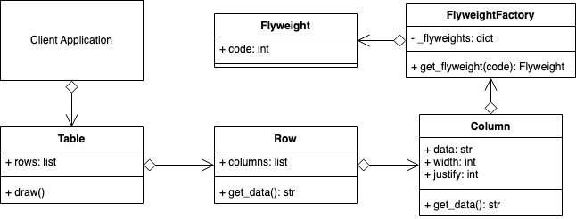
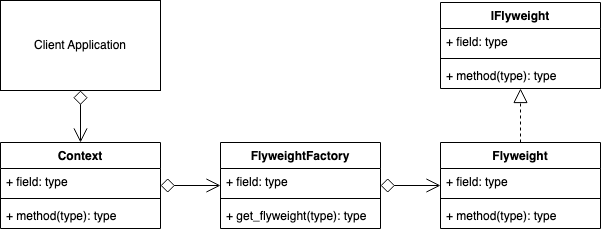

# Flyweight Design Pattern
## Overview 
Fly in the term Flyweight means light/not heavy.

Instead of creating thousands of objects that share common attributes, and result in a situation where a large amount of memory or other resources are used, you can modify your classes to share multiple instances simultaneously by using some kind of reference to the shared object instead.

The best example to describe this is a document containing many words and sentences and made up of many letters. Rather than storing a new object for each individual letter describing its font, position, color, padding and many other potential things. You can store just a lookup ID of a character in a collection of some sort and then dynamically create the object with its proper formatting etc., only as you need to.

This approach saves a lot of memory at the expense of using some extra CPU instead to create the object at presentation time.

The Flyweight pattern, describes how you can share objects rather than creating thousands of almost repeated objects unnecessarily.

A Flyweight acts as an independent object in any number of contexts. A context can be a cell in a table, or a div on an HTML page. A context is using the Flyweight.

You can have many contexts, and when they ask for a Flyweight, they will get an object that may already be shared amongst other contexts, or already within itself somewhere else.

When describing flyweights, it is useful to describe it in terms of intrinsic and extrinsic attributes.

Intrinsic (in or including) are the attributes of a flyweight that are internal and unique from the other flyweights. E.g., a new flyweight for every letter of the alphabet. Each letter is intrinsic to the flyweight.

Extrinsic (outside or external) are the attributes that are used to present the flyweight in terms of the context where it will be used. E.g., many letters in a string can be right aligned with each other. The extrinsic property of each letter is the new positioning of its X and Y on a grid.
## Decorator UML Diagram

## Builder Example UML Diagram

## Summary
- Use the decorator when you want to add responsibilities to objects dynamically without affecting the inner object.
- You want the option to later remove the decorator from an object in case you no longer need it.
- It is an alternative method to creating multiple combinations of subclasses. I.e., Instead of creating a subclass with all combinations of objects A, B, C in any order, and including/excluding objects, you could create 3 objects that can decorate each other in any order you want. E.g., (D(A(C))) or (B(C)) or (A(B(A(C))))
- The decorator, compared to using static inheritance to extend, is more flexible since you can easily add/remove the decorators at runtime. E.g., use in a recursive function.
- A decorator supports recursive composition. E.g., halve(halve(number))
- A decorator shouldn't modify the internal objects data or references. This allows the original object to stay intact if the decorator is later removed.