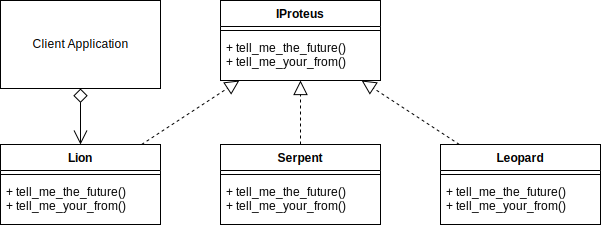

# Proxy Design Pattern
## Overview 
Fly in the term Flyweight means light/not heavy.

The Proxy design pattern is a class functioning as an interface to another class or object.

A Proxy could be for anything, such as a network connection, an object in memory, a file, or anything else you need to provide an abstraction between.

Types of proxies,

- Virtual Proxy: An object that can cache parts of the real object, and then complete loading the full object when necessary.

- Remote Proxy: Can relay messages to a real object that exists in a different address space.

- Protection Proxy: Apply an authentication layer in front of the real object.

- Smart Reference: An object whose internal attributes can be overridden or replaced.

Additional functionality can be provided at the proxy abstraction if required. E.g., caching, authorization, validation, lazy initialization, logging.

The proxy should implement the subject interface as much as possible so that the proxy and subject appear identical to the client.

The Proxy Pattern can also be called Monkey Patching or Object Augmentation
## Decorator UML Diagram

## Builder Example UML Diagram

## Summary
- Use the decorator when you want to add responsibilities to objects dynamically without affecting the inner object.
- You want the option to later remove the decorator from an object in case you no longer need it.
- It is an alternative method to creating multiple combinations of subclasses. I.e., Instead of creating a subclass with all combinations of objects A, B, C in any order, and including/excluding objects, you could create 3 objects that can decorate each other in any order you want. E.g., (D(A(C))) or (B(C)) or (A(B(A(C))))
- The decorator, compared to using static inheritance to extend, is more flexible since you can easily add/remove the decorators at runtime. E.g., use in a recursive function.
- A decorator supports recursive composition. E.g., halve(halve(number))
- A decorator shouldn't modify the internal objects data or references. This allows the original object to stay intact if the decorator is later removed.